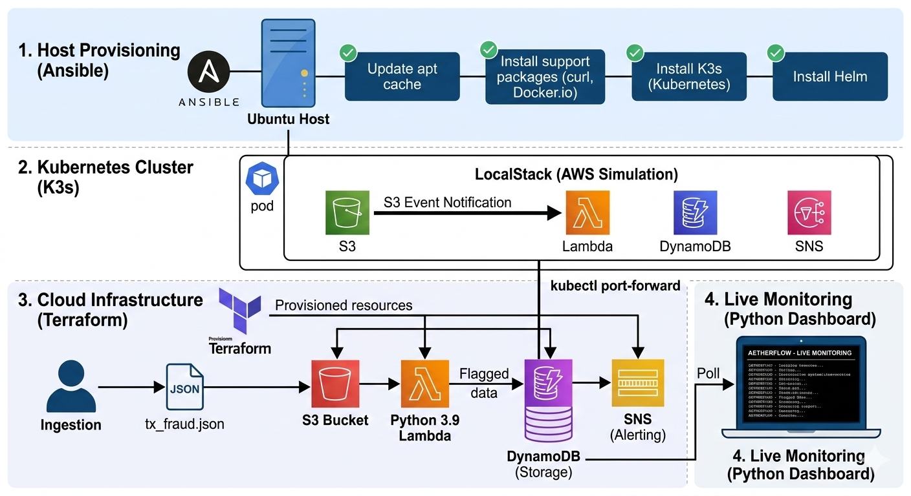

# 🌊 AetherFlow: Serverless Fraud Detection System

[](https://www.ansible.com/)
[](https://www.terraform.io/)
[](https://k3s.io/)
[](https://www.python.org/)

AetherFlow is a high-performance, **event-driven data pipeline** designed for real-time financial monitoring. This project demonstrates a complete DevOps lifecycle: from raw OS provisioning to a fully functional serverless cloud architecture.



## 🏗 System Architecture & Design

The system follows a multi-layered automation strategy, ensuring that the entire environment is reproducible and scalable.


### 🛰️ End-to-End Automation & Data Flow
The deployment begins with **Ansible**, which provisions the base Ubuntu host with **Docker**, **K3s (Kubernetes)**, and **Helm**. Once the platform is stable, **Terraform** initializes the serverless AWS-compatible resources within **LocalStack** (running as a K8s pod).

**The real-time data flow works as follows:**
1.  **Ingestion:** A transaction JSON file is uploaded to the **S3 Bucket**.
2.  **Processing:** An asynchronous S3 Event triggers the **Python 3.9 Lambda** processor.
3.  **Logic:** The Lambda performs validation:
    * ✅ **Amount < 1000 USD:** Approved and stored in **DynamoDB**.
    * 🚩 **Amount ≥ 1000 USD:** Flagged as suspicious, stored in **DynamoDB**, and published to an **SNS Topic**.
4.  **Observability:** A dedicated **Python Dashboard** continuously polls DynamoDB for live metrics and alerts.


## 🛠 Setup & Deployment

### 1. Provision the Host Environment (Ansible)
Prepare your Ubuntu machine with K3s, Docker, and Helm by running the automated playbook:
```bash
ansible-playbook setup_ubuntu.yml --ask-become-pass
```
This ensures all system dependencies and Kubernetes nodes are correctly initialized.

### 2. Establish Connection (The Tunnel)
Since LocalStack is running inside K8s, you **must** expose the service to your localhost:
```bash
sudo kubectl port-forward svc/localstack 4566:4566 -n default
```
Keep this terminal window open during the entire session.

### 3. Initialize Infrastructure
In a new terminal window, deploy the cloud resources:
```bash
cd terraform
terraform init
terraform apply -auto-approve
```

### 4. Run the Live Dashboard
Navigate to the root directory and launch the monitoring tool:
```bash
source venv/bin/activate
pip install pandas tabulate boto3
python3 dashboard.py
```

## 📊 Live Monitoring Preview
When the system is operational, the dashboard provides real-time statistics directly from DynamoDB:

| ID | S3 Object Key | Amount (USD) | Detection Status |
|----|---------------|--------------|------------------|
| 0  | tx_ok.json    | 150          | APPROVED         |
| 1  | tx_alert.json | 12000        | FLAGGED          |
| 2  | tx_fraud.json | 5500         | FLAGGED          |

**Current Status:** `OPERATIONAL` | **Transactions:** 3 | **SNS Alerts:** 2  
**Total Blocked Amount:** 17500.00 USD


### 🧹 Cleanup
To avoid resource leaks, clean the S3 bucket before destroying the stack:
```bash
# Empty the bucket
aws --endpoint-url=http://localhost:4566 s3 rm s3://aetherflow-transactions --recursive
```

```bash
# Destroy infrastructure
terraform destroy -auto-approve
```
